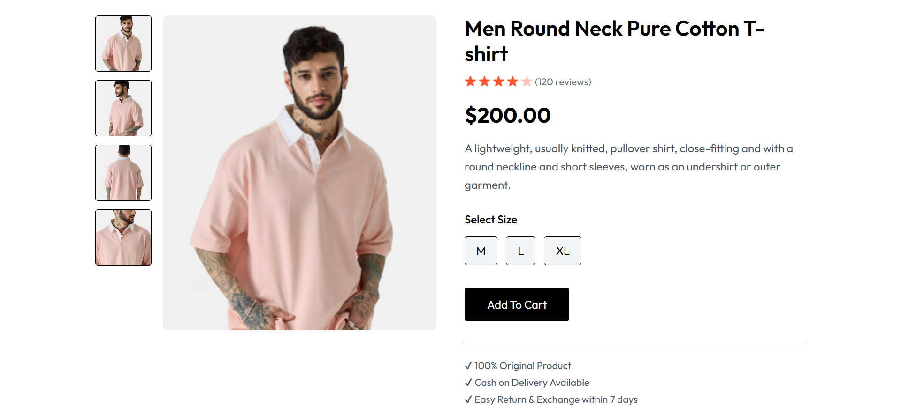
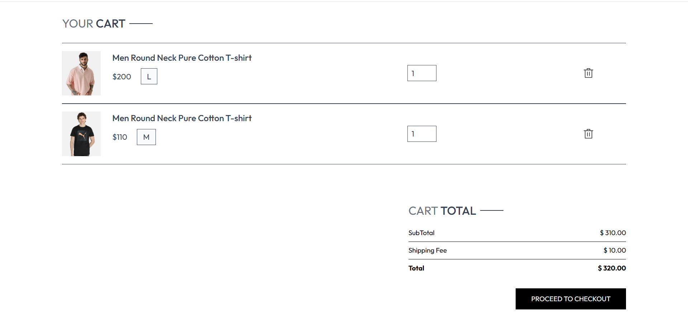
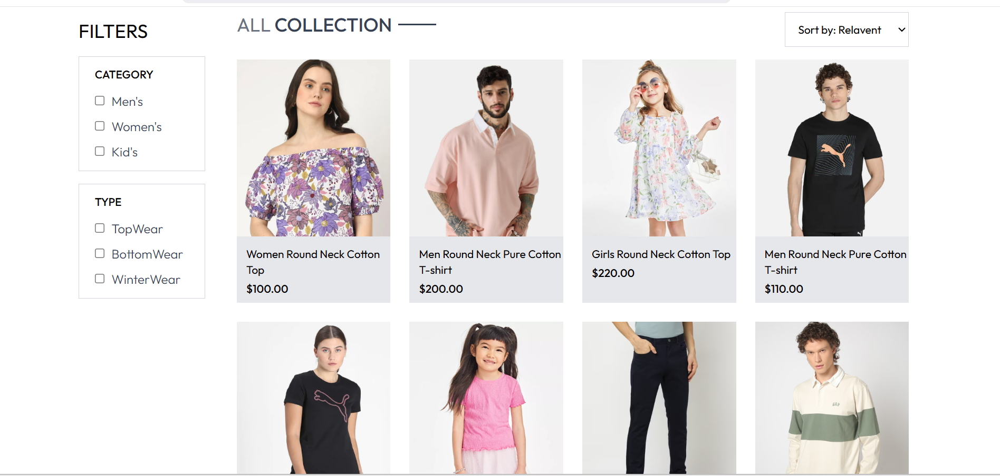
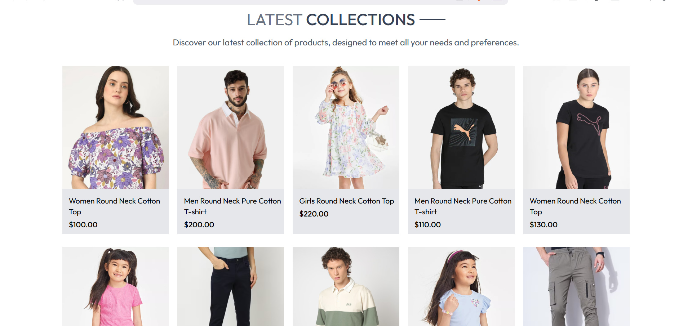
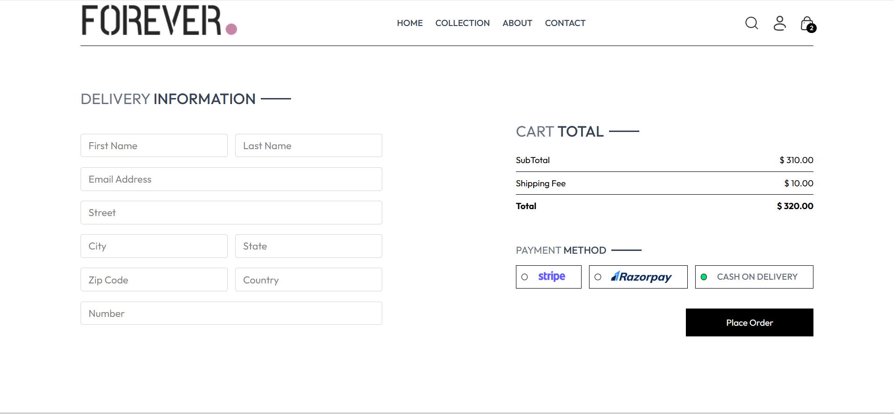
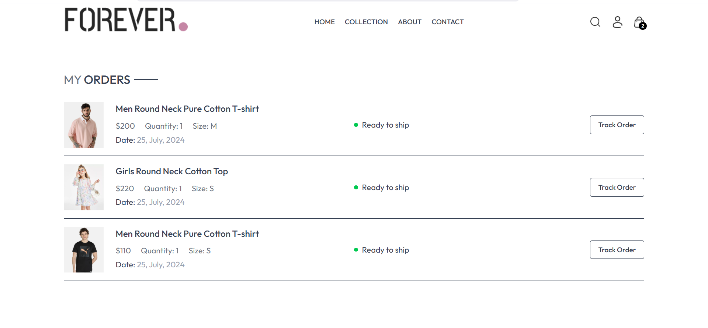
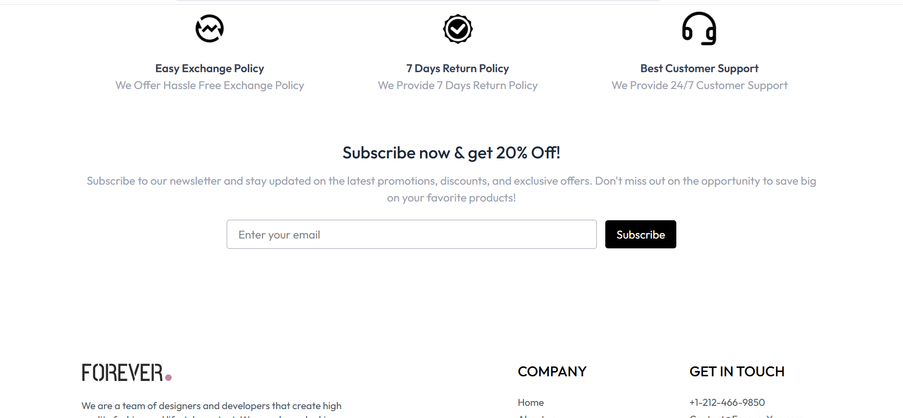

🛒 Forever - React E-Commerce Website

Forever E-Commerce Website is a modern and responsive online shopping interface built using React.js and Tailwind CSS. The application allows users to browse products, view detailed product information, select sizes, add items to the cart, and proceed to checkout with multiple payment options.

The project demonstrates strong frontend development skills, including component-based architecture, client-side routing, responsive UI design, and state management using React Context API. The focus of the project is to build a clean, scalable, and user-friendly e-commerce interface similar to real-world online shopping platforms.

Project Features

Responsive e-commerce website design

Modern UI built with Tailwind CSS

Product listing page

Product detail page with image gallery

Size selection for products

Add to cart functionality

Cart item count indicator

Cart total calculation

Checkout / place order page

Delivery information form

Multiple payment options UI (Stripe, Razorpay, Cash on Delivery)

Toast notifications for user actions

Client-side routing using React Router

Tech Stack
Frontend

React.js

Tailwind CSS

Vite

Libraries

React Router DOM

React Toastify

Development Tools

Node.js

npm

Git & GitHub

VS Code

# 📸 Project Screenshots

### Home Page

### Product Page

### Cart Page

### Collection Page

### Latest Products

### Place Order Page

### Orders Page

### Footer

